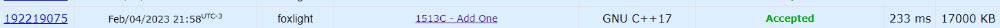
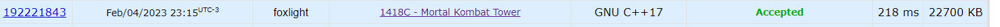
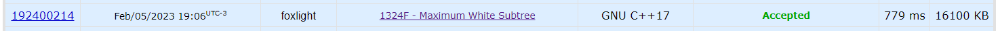
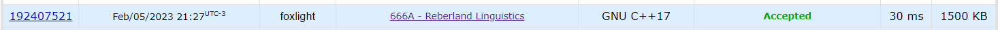

Temas:
 - PD

# DP_Problemas_DUPLA-25

**Número da Lista**: 25 
**Conteúdo da Disciplina**: Programação dinâmica (Dinamic programing) 

## Alunos
|Matrícula | Aluno |
| -- | -- |
| 18/0068229  |  Victor Yukio Cavalcanti Miki |
| 18/0016067  |  Erick Levy |

## Sobre 
Resolvemos optar por realizar 4 questões sobre a matéria de programação dinâmica. Você pode encontrar o código fonte das questão em cada uma das pastas que contêm um READEME.md explicando sobre a questão com o link no repositório.

## Screenshots

## Instalação 
**Linguagem**: c++ 
**Framework**: - 
compilador de c++: **g++**

## Uso 
Dentro de cada pasta ira conter um README para cada problema e como rodar em seu computador.

## Outros 
Obrigado!
